---
layout: post
title: Mycat
slug: my-first-awesome-post
date: 2019-12-17 20:34
status: publish
author: <填写你的名字>
categories: 
  - 默认分类
tags: 
  - 博客
  - GitHub
excerpt: Hello World!

---

Mycat基于阿里开源的Cobar产品而研发。Mycat 是数据库中间件 。

下载地址：<http://www.mycat.io/>

### 理论

**什么是中间件**

中间件： 是一类连接软件组件和应用的计算机软件， 以便于软件各部件之间的沟通。
例子： Tomcat， web中间件。
数据库中间件： 连接java应用程序和数据库 


**为什么要使用Myat**

1. Java与数据库紧耦合。
2. 高访问量高并发对数据库的压力。
3. 读写请求数据不一致

**Mycat架构图**


**能干什么**

- 读写分离 ：

  Mycat作为中间件，Mycat把**写**请求发送主主机master，**读**请求发送个从主机slave。主主机和从主机之间进行Mysql的主从复制。从主机复制主主机。

- 数据分片 ：垂直拆分（分库） 、 水平拆分（分表） 、 垂直+水平拆分（分库分表） 

- 多数据源整合 ：支持各种数据库。

  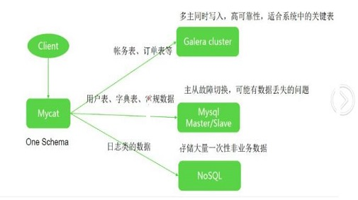

  **原理**

  Mycat 的原理中最重要的一个动词是“**拦截**”，它拦截了用户发送过来的 SQL 语句，首先对 SQL
  语句做了一些特定的分析：如分片分析、路由分析、读写分离分析、缓存分析等，然后将此 SQL 发往后端的真实数据库， 并将返回的结果做适当的处理，最终再返回给用户。 


### 安装Mycat

由于Mycat下载的即可使用

下载：Mycat-server-1.6.7.1-release-20190627191042-linux.tar.gz 安装包。地址：<http://dl.mycat.io/>

```
 wget http://dl.mycat.io/1.6.7.1/Mycat-server-1.6.7.1-release-20190627191042-linux.tar.gz
 tar -xzvf  Mycat-server-1.6.7.1-release-20190627191042-linux.tar.gz -C /usr/local/
```


**目录结构**

--bin 启动目录

--conf 配置目录存放配置文件：

```
  --server.xml：是Mycat服务器参数调整和用户授权的配置文件。
  
  --schema.xml：是逻辑库定义和表以及分片定义的配置文件。
  
  --rule.xml：  是分片规则的配置文件，分片规则的具体一些参数信息单独存放为文件，也在这个目录下，配置文件修改需要重启MyCAT。

  --log4j.xml： 日志存放在logs/log中，每天一个文件，日志的配置是在conf/log4j.xml中，根据自己的需要可以调整输出级别为debug ，debug级别下，会输出更多的信息，方便排查问题。

  --autopartition-long.txt,partition-hash-int.txt,sequence_conf.properties， sequence_db_conf.properties 分片相关的id分片规则配置文件

  --lib	    MyCAT自身的jar包或依赖的jar包的存放目录。
  --logs        MyCAT日志的存放目录。日志存放在logs/log中，每天一个文件
```

**Mycat参考命令**:

**linux**

```
./mycat start 启动

./mycat stop 停止

./mycat console 前台运行

./mycat install 添加到系统自动启动（暂未实现）

./mycat remove 取消随系统自动启动（暂未实现）

./mycat restart 重启服务

./mycat pause 暂停

./mycat status 查看启动状态
```

若需要修改Mycat的Jvm配置参数，打开conf/wrapper.conf文件修改即可。Mycat的连接方式和Mysql连接方式一样。例如：

```shell
mysql -uroot -proot -P8066 -h127.0.0.1   #启动前需要修改Mycat的配置文件
```

**配置图：**


**Serverl.xml:**

```
<?xml version="1.0" encoding="UTF-8"?>
<!DOCTYPE mycat:server SYSTEM "server.dtd">
<mycat:server xmlns:mycat="http://io.mycat/">
	<system>
	<property name="nonePasswordLogin">0</property> <!-- 0为需要密码登陆、1为不需要密码登陆 ,默认为0，设置为1则需要指定默认账户-->
	<property name="useHandshakeV10">1</property>
	<property name="useSqlStat">0</property>  <!-- 1为开启实时统计、0为关闭 -->
	<property name="useGlobleTableCheck">0</property>  <!-- 1为开启全加班一致性检测、0为关闭 -->
	<property name="sequnceHandlerType">2</property>
    <!--必须带有MYCATSEQ_或者 mycatseq_进入序列匹配流程 注意MYCATSEQ_有空格的情况-->
	<property name="sequnceHandlerPattern">(?:(\s*next\s+value\s+for\s*MYCATSEQ_(\w+))(,|\)|\s)*)+</property>
	<property name="subqueryRelationshipCheck">false</property> <!-- 子查询中存在关联查询的情况下,检查关联字段中是否有分片字段 .默认 false -->
  <!--<property name="useCompression">1</property>--> <!--1为开启mysql压缩协议-->
  <!-- <property name="fakeMySQLVersion">5.6.20</property>--> <!--设置模拟的MySQL版本号-->
  <!-- <property name="processorBufferChunk">40960</property> -->
  <!-- <property name="processors">1</property> 
      <property name="processorExecutor">32</property> 
  -->
   <!--默认为type 0: DirectByteBufferPool | type 1 ByteBufferArena | type 2 NettyBufferPool -->
    <property name="processorBufferPoolType">0</property>
		<!--默认是65535 64K 用于sql解析时最大文本长度 -->
		<!--<property name="maxStringLiteralLength">65535</property>-->
		<!--<property name="sequnceHandlerType">0</property>-->
		<!--<property name="backSocketNoDelay">1</property>-->
		<!--<property name="frontSocketNoDelay">1</property>-->
		<!--<property name="processorExecutor">16</property>-->
		<!--
		<property name="serverPort">8066</property> <property name="managerPort">9066</property> 
		<property name="idleTimeout">300000</property> <property name="bindIp">0.0.0.0</property> 
		<property name="frontWriteQueueSize">4096</property> <property name="processors">32</property> -->
		<!--分布式事务开关，0为不过滤分布式事务，1为过滤分布式事务（如果分布式事务内只涉及全局表，则不过滤），2为不过滤分布式事务,但是记录分布式事务日志-->
		<property name="handleDistributedTransactions">0</property>
		<!--  off heap for merge/order/group/limit      1开启   0关闭   -->
		<property name="useOffHeapForMerge">0</property>

		<!--   单位为m    -->
        <property name="memoryPageSize">64k</property>

		<!--    单位为k    -->
		<property name="spillsFileBufferSize">1k</property>

		<property name="useStreamOutput">0</property>

		<!--    单位为m   -->
		<property name="systemReserveMemorySize">384m</property>
		
		<!--是否采用zookeeper协调切换  -->
		<property name="useZKSwitch">false</property>

		<!-- XA Recovery Log日志路径 -->
		<!--<property name="XARecoveryLogBaseDir">./</property>-->

		<!-- XA Recovery Log日志名称 -->
		<!--<property name="XARecoveryLogBaseName">tmlog</property>-->
		<!--如果为 true的话 严格遵守隔离级别,不会在仅仅只有select语句的时候在事务中切换连接-->
		<property name="strictTxIsolation">false</property>
		
		<property name="useZKSwitch">true</property>
		
	</system>
	
	<!-- 全局SQL防火墙设置 -->
	<!--白名单可以使用通配符%或着*-->
	<!--例如<host host="127.0.0.*" user="root"/>-->
	<!--例如<host host="127.0.*" user="root"/>-->
	<!--例如<host host="127.*" user="root"/>-->
	<!--例如<host host="1*7.*" user="root"/>-->
	<!--这些配置情况下对于127.0.0.1都能以root账户登录-->
	<!--
	<firewall>
	   <whitehost>
	      <host host="1*7.0.0.*" user="root"/>
	   </whitehost>
       <blacklist check="false">
       </blacklist>
	</firewall>
	-->

	<user name="root" defaultAccount="true">
		<property name="password">123456</property>
		<property name="schemas">TESTDB</property>
		
		<!-- 表级 DML 权限设置 -->
		<!-- 		
		<privileges check="false">
			<schema name="TESTDB" dml="0110" >
				<table name="tb01" dml="0000"></table>
				<table name="tb02" dml="1111"></table>
			</schema>
		</privileges>		
		 -->
	</user>

	<user name="user">
		<property name="password">user</property>
		<property name="schemas">TESTDB</property>
		<property name="readOnly">true</property>
	</user>

</mycat:server>

```

上面主要是：

- system 参数是所有的mycat参数配置，
- user 是用户参数。
- firewall：用来定义防火墙； firewall 下 whitehost 标签用来定义 IP 白名单 ， blacklist 用来定义
  SQL 黑名单。 

**schema.xml** 

```shell
<?xml version="1.0"?>
<!DOCTYPE mycat:schema SYSTEM "schema.dtd">
<mycat:schema xmlns:mycat="http://io.mycat/">

	<schema name="TESTDB" checkSQLschema="false" sqlMaxLimit="100">
		<table name="travelrecord" dataNode="dn1,dn2,dn3" rule="auto-sharding-long" />
		<table name="company" primaryKey="ID" type="global" dataNode="dn1,dn2,dn3" />
		<table name="goods" primaryKey="ID" type="global" dataNode="dn1,dn2" />
		<table name="hotnews" primaryKey="ID" autoIncrement="true" dataNode="dn1,dn2,dn3"
			   rule="mod-long" />
		<table name="employee" primaryKey="ID" dataNode="dn1,dn2"
			   rule="sharding-by-intfile" />
		<table name="customer" primaryKey="ID" dataNode="dn1,dn2"
			   rule="sharding-by-intfile">
			<childTable name="orders" primaryKey="ID" joinKey="customer_id"
						parentKey="id">
				<childTable name="order_items" joinKey="order_id"
							parentKey="id" />
			</childTable>
			<childTable name="customer_addr" primaryKey="ID" joinKey="customer_id"
						parentKey="id" />
		</table>
	</schema>
	<dataNode name="dn1" dataHost="localhost1" database="db1" />
	<dataNode name="dn2" dataHost="localhost1" database="db2" />
	<dataNode name="dn3" dataHost="localhost1" database="db3" />
	<dataHost name="localhost1" maxCon="1000" minCon="10" balance="0"  writeType="0" dbType="mysql" dbDriver="native" switchType="1"  slaveThreshold="100">
        <heartbeat>select user()</heartbeat>
        <writeHost host="hostM1" url="localhost:3306" user="root"  password="123456">
            <readHost host="hostS2" url="192.168.1.200:3306" user="root" password="xxx" />
        </writeHost>
        <writeHost host="hostS1" url="localhost:3316" user="root"  password="123456" />
	</dataHost>

</mycat:schema>
```

上面**schema** 是实际逻辑库的配置，多个**schema**代表多个逻辑库。**dataNode**是逻辑库对应的分片，如果配置多个分片只需要多个**dataNode**即可。**dataHost**是实际的物理库配置地址，可以配置多主主从等其他配置，多个dataHost代表分片对应的物理库地址，**writeHost**、**readHost**代表该分片是否配置多写，主从，读写分离等高级特性。


**rule.xml**

```shell
<?xml version="1.0" encoding="UTF-8"?>
<!DOCTYPE mycat:rule SYSTEM "rule.dtd">
<mycat:rule xmlns:mycat="http://io.mycat/">
	<tableRule name="rule1">
		<rule>
			<columns>id</columns>
			<algorithm>func1</algorithm>
		</rule>
	</tableRule>

	<tableRule name="rule2">
		<rule>
			<columns>user_id</columns>
			<algorithm>func1</algorithm>
		</rule>
	</tableRule>

	<tableRule name="sharding-by-intfile">
		<rule>
			<columns>sharding_id</columns>
			<algorithm>hash-int</algorithm>
		</rule>
	</tableRule>
	<tableRule name="auto-sharding-long">
		<rule>
			<columns>id</columns>
			<algorithm>rang-long</algorithm>
		</rule>
	</tableRule>
	<tableRule name="mod-long">
		<rule>
			<columns>id</columns>
			<algorithm>mod-long</algorithm>
		</rule>
	</tableRule>
	<tableRule name="sharding-by-murmur">
		<rule>
			<columns>id</columns>
			<algorithm>murmur</algorithm>
		</rule>
	</tableRule>
	<tableRule name="crc32slot">
		<rule>
			<columns>id</columns>
			<algorithm>crc32slot</algorithm>
		</rule>
	</tableRule>
	<tableRule name="sharding-by-month">
		<rule>
			<columns>create_time</columns>
			<algorithm>partbymonth</algorithm>
		</rule>
	</tableRule>
	<tableRule name="latest-month-calldate">
		<rule>
			<columns>calldate</columns>
			<algorithm>latestMonth</algorithm>
		</rule>
	</tableRule>
	
	<tableRule name="auto-sharding-rang-mod">
		<rule>
			<columns>id</columns>
			<algorithm>rang-mod</algorithm>
		</rule>
	</tableRule>
	
	<tableRule name="jch">
		<rule>
			<columns>id</columns>
			<algorithm>jump-consistent-hash</algorithm>
		</rule>
	</tableRule>

	<function name="murmur"
		class="io.mycat.route.function.PartitionByMurmurHash">
		<property name="seed">0</property><!-- 默认是0 -->
		<property name="count">2</property><!-- 要分片的数据库节点数量，必须指定，否则没法分片 -->
		<property name="virtualBucketTimes">160</property><!-- 一个实际的数据库节点被映射为这么多虚拟节点，默认是160倍，也就是虚拟节点数是物理节点数的160倍 -->
		<!-- <property name="weightMapFile">weightMapFile</property> 节点的权重，没有指定权重的节点默认是1。以properties文件的格式填写，以从0开始到count-1的整数值也就是节点索引为key，以节点权重值为值。所有权重值必须是正整数，否则以1代替 -->
		<!-- <property name="bucketMapPath">/etc/mycat/bucketMapPath</property> 
			用于测试时观察各物理节点与虚拟节点的分布情况，如果指定了这个属性，会把虚拟节点的murmur hash值与物理节点的映射按行输出到这个文件，没有默认值，如果不指定，就不会输出任何东西 -->
	</function>

	<function name="crc32slot"
			  class="io.mycat.route.function.PartitionByCRC32PreSlot">
	</function>
	<function name="hash-int"
		class="io.mycat.route.function.PartitionByFileMap">
		<property name="mapFile">partition-hash-int.txt</property>
	</function>
	<function name="rang-long"
		class="io.mycat.route.function.AutoPartitionByLong">
		<property name="mapFile">autopartition-long.txt</property>
	</function>
	<function name="mod-long" class="io.mycat.route.function.PartitionByMod">
		<!-- how many data nodes -->
		<property name="count">3</property>
	</function>

	<function name="func1" class="io.mycat.route.function.PartitionByLong">
		<property name="partitionCount">8</property>
		<property name="partitionLength">128</property>
	</function>
	<function name="latestMonth"
		class="io.mycat.route.function.LatestMonthPartion">
		<property name="splitOneDay">24</property>
	</function>
	<function name="partbymonth"
		class="io.mycat.route.function.PartitionByMonth">
		<property name="dateFormat">yyyy-MM-dd</property>
		<property name="sBeginDate">2015-01-01</property>
	</function>
	
	<function name="rang-mod" class="io.mycat.route.function.PartitionByRangeMod">
        	<property name="mapFile">partition-range-mod.txt</property>
	</function>
	
	<function name="jump-consistent-hash" class="io.mycat.route.function.PartitionByJumpConsistentHash">
		<property name="totalBuckets">3</property>
	</function>
</mycat:rule>
```

### 配置Mycat

#### 修改配置文件server.xml

修改用户信息，与MySQL区分， 如下： 

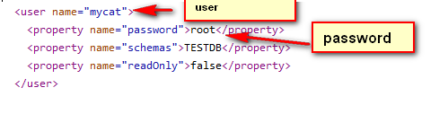

#### 修改配置文件 schema.xml 

删除<schema>标签间的表信息， <dataNode>标签只留一个， <dataHost>标签只留一个， <writeHost>
<readHost>只留一对 

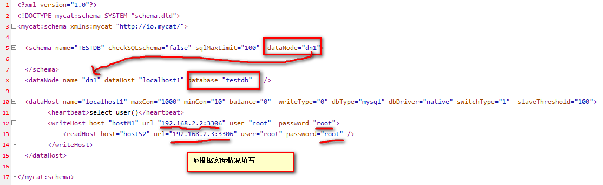


#### 测试是否能连接

测试前，先开启Mysql的远程访问权限和关闭防火墙（或者放行3306端口）。然后测试本机是否能够通过远程方式连接本机。

主机1：192.168.2.2

```shell
 mysql -uroot -proot -h192.168.2.2 -P3306
```

主机2：

```shell
 mysql -uroot -proot -h192.168.2.3 -P3306
```

测试成功在继续下一步。登录mycat，默认端口为8066.可以通过server.xml中<property name="serverPort">8066</property>来修改端口

```
mysql -umycat -proot -h 192.168.2.2 -P8066  
```

这时候可以看到TESTDB，但是如要操作TESTDB。需要在主机1：192.168.2.2和主机2：192.168.2.3中创建testdb。schema.xml中就是这么配置。如上图。

```
mysql> show @@version;
+---------------------------------------------+
| VERSION                                     |
+---------------------------------------------+
| 5.6.29-mycat-1.6.7.1-release-20190627191042 |
+---------------------------------------------+
1 row in set (0.00 sec)

```

###  搭建读写分离

#### 搭建一主一从 

一个主机用于处理所有写请求，一台从机负责所有读请求， 

架构:


一主一从搭建比较容易。但是需要先搭建主机（192.168.2.2）和 从机（192.168.2.3）之间的主从复制。


##### 主从复制

原理图：


- master
  - binlog dump线程：当主库中有数据更新时，那么主库就会根据按照设置的binlog格式，将此次更新的事件类型写入到主库的binlog文件中，此时主库会创建log dump线程通知slave有数据更新，当I/O线程请求日志内容时，会将此时的binlog名称和当前更新的位置同时传给slave的I/O线程。
- slave
  - I/O线程：该线程会连接到master，向log dump线程请求一份指定binlog文件位置的副本，并将请求回来的binlog存到本地的relay log中，relay log和binlog日志一样也是记录了数据更新的事件，它也是按照递增后缀名的方式，产生多个relay log（ host_name-relay-bin.000001）文件，slave会使用一个index文件（ host_name-relay-bin.index）来追踪当前正在使用的relay log文件。
  - SQL线程：该线程检测到relay log有更新后，会读取并在本地做redo操作，将发生在主库的事件在本地重新执行一遍，来保证主从数据同步。此外，如果一个relay log文件中的全部事件都执行完毕，那么SQL线程会自动将该relay log 文件删除掉。


MySQL复制支持多种不同的复制策略，包括*同步、半同步、异步和延迟策略*等。

1. **同步策略**：Master要等待所有Slave应答之后才会提交（MySql对DB操作的提交通常是先对操作事件进行二进制日志文件写入然后再进行提交）。
2. **半同步策略**：Master等待至少一个Slave应答就可以提交。
3. **异步策略**：Master不需要等待Slave应答就可以提交。
4. **延迟策略**：Slave要至少落后Master指定的时间


根据binlog日志格式的不同，MySQL复制同时支持多种不同的复制模式：

1. **基于语句的复制，即Statement** Based Replication（SBR）：记录每一条更改数据的sql

- 优点：binlog文件较小，节约I/O，性能较高。
- 缺点：不是所有的数据更改都会写入binlog文件中，尤其是使用MySQL中的一些特殊函数（如LOAD_FILE()、UUID()等）和一些不确定的语句操作，从而导致主从数据无法复制的问题。

2. 基于行的复制，即**Row** Based Replication（RBR）：不记录sql，只记录每行数据的更改细节

- 优点：详细的记录了每一行数据的更改细节，这也意味着不会由于使用一些特殊函数或其他情况导致不能复制的问题。
- 缺点：由于row格式记录了每一行数据的更改细节，会产生大量的binlog日志内容，性能不佳，并且会增大主从同步延迟出现的几率。

3. 混合复制（Mixed）

   一般的语句修改使用statment格式保存binlog，如一些函数，statement无法完成主从复制的操作，则采用row格式保存binlog，MySQL会根据执行的每一条具体的sql语句来区分对待记录的日志形式，也就是在Statement和Row之间选择一种。


修改主机1的mysql配置文件：

```shell
vim /etc/my.cnf
```

my.cnf:   在[mysqld]标签下

```
#主服务器唯一ID
server-id=1
#启用二进制日志
log-bin=mysql-bin
## 设置不要复制的数据库(可设置多个)
binlog-ignore-db=mysql
binlog-ignore-db=information_schema
##设置需要复制的数据库
binlog-do-db=testdb
##设置logbin格式
binlog_format=STATEMENT
```

重启Mysql数据库 并重新登录：

```
create user slave IDENTIFIED BY 'root';
GRANT REPLICATION SLAVE ON *.* TO 'slave'@'%' IDENTIFIED BY 'root';
flush privileges;
```

若提示密码不符合要求，这修改Mysql的策略：

```shell
set global validate_password_policy=LOW; 
set global validate_password_length=4; 
flush privileges;
```


修改从机的配置：

```
vim /eyc/my.cnf
```

配置如下（本次的从机的系统为centos8）：

```
[mysqld]
server-id=2
relay-log=mysql-relay
```

如图：


查询**主机**master的状态：

```shell
mysql> show master status;
+------------------+----------+--------------+--------------------------+-------------------+
| File             | Position | Binlog_Do_DB | Binlog_Ignore_DB         | Executed_Gtid_Set |
+------------------+----------+--------------+--------------------------+-------------------+
| mysql-bin.000002 |      154 | testdb       | mysql,information_schema |                   |
+------------------+----------+--------------+--------------------------+-------------------+
1 row in set (0.00 sec)
```

***---》 记录下File和Position的值，执行完此步骤后不要再操作主服务器MySQL，防止主服务器状态值变化***


在**从机**上配置需要复制的主机 ：

格式：

```
CHANGE MASTER TO MASTER_HOST='主机的IP地址',
MASTER_USER='slave',
MASTER_PASSWORD='123123',
MASTER_LOG_FILE='mysql-bin.具体数字',MASTER_LOG_POS=具体值;
```

本次配置为：(在从机上运行,下面参数根据具体情况修改)

```
CHANGE MASTER TO MASTER_HOST='192.168.2.2',
MASTER_USER='slave',
MASTER_PASSWORD='root',
MASTER_LOG_FILE='mysql-bin.000002',MASTER_LOG_POS=154;
```

启动从服务器复制功能

`start slave;`

查看从服务器状态

`show slave status\G;` 

无报错这成功，如下图：

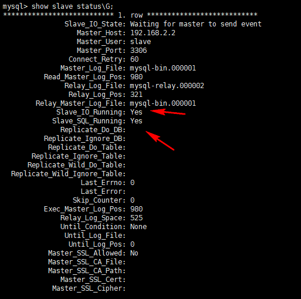

补充几个命令：

`stop slave;  #停止slave`
`reset master;   #重置master`


因为配置中使用testdb，所以要在主机一（192.168.2.2）和主机二（192.168.2.3）创建数据库testdb

```sql
create database testdb;

create table my(
id varchar(10),
hostname varchar(120)
);
insert into my values (1,@@hostname);  ##由于本次实验@@hostname在两个主机的内容，为了区分，直接使用工具分别修改这个表的值为centos7和centos8

mysql> select * from my;
+------+----------+
| id   | hostname |
+------+----------+
| 1    | centos7  |
+------+----------+
#多次执行查询语句，都是输出centos7，读请求都发送到写主机上。未开启读写分离。
```

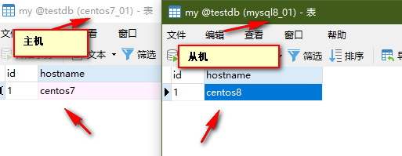

#### 开启读写分离

修改schema.xml 的<dataHost>的balance属性，通过此属性配置读写分离的类型 

负载均衡类型，目前的取值有4 种：
（1） balance="0", 不开启读写分离机制， 所有读操作都发送到当前可用的 writeHost 上。
（2） balance="1"，全部的 readHost 与 stand by writeHost 参与 select 语句的负载均衡，简单的说，当双主双从
模式(M1->S1， M2->S2，并且 M1 与 M2 互为主备)，正常情况下， M2,S1,S2 都参与 select 语句的负载均衡。
（3） balance="2"，所有读操作都随机的在 writeHost、 readhost 上分发。
（4） balance="3"，所有读请求随机的分发到 readhost 执行， writerHost 不负担读压力 


修改balance值为1，开启读写分离。但是由于只有一个主机和从机。这个结果会和balance=3的结果一样，所以本次修改为2，这样可以看到不一样的结果。修改完成后重启Mycat。

效果如下：

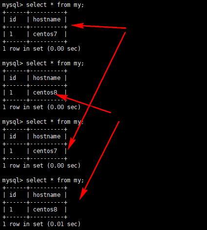


#### 搭建双主双从

结果图：

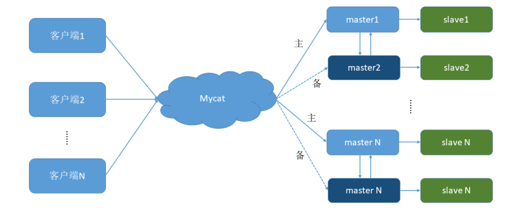

**双主双从：**

主1：192.168.2.2

从1：192.168.2.3

主2：192.168.2.5

从2：192.168.2.6


##### 配置如下

修改配置：

```
vim /etc/my.cnf   #下面四台机器都是修改这个给文件
```

主（master）1:

```
#主服务器唯一ID
server-id=1
#启用二进制日志
log-bin=mysql-bin
# 设置不要复制的数据库(可设置多个)
binlog-ignore-db=mysql
binlog-ignore-db=information_schema
#设置需要复制的数据库
binlog-do-db=testdb   #需要复制的主数据库名字
#设置logbin格式
binlog_format=STATEMENT
# 在作为从数据库的时候， 有写入操作也要更新二进制日志文件
log-slave-updates
#表示自增长字段每次递增的量，指自增字段的起始值，其默认值是1， 取值范围是1 .. 65535
auto-increment-increment=2
# 表示自增长字段从哪个数开始，指字段一次递增多少，他的取值范围是1 .. 65535
auto-increment-offset=1
```

主机（master）二：

```
#主服务器唯一ID
server-id=3
#启用二进制日志
log-bin=mysql-bin
# 设置不要复制的数据库(可设置多个)
binlog-ignore-db=mysql
binlog-ignore-db=information_schema
#设置需要复制的数据库
binlog-do-db=testdb   #需要复制的主数据库名字
#设置logbin格式
binlog_format=STATEMENT
# 在作为从数据库的时候，有写入操作也要更新二进制日志文件
log-slave-updates
#表示自增长字段每次递增的量，指自增字段的起始值，其默认值是1，取值范围是1 .. 65535
auto-increment-increment=2
# 表示自增长字段从哪个数开始，指字段一次递增多少，他的取值范围是1 .. 65535
auto-increment-offset=2
```

从机（slave）一：

```
#从服务器唯一ID
server-id=2
#启用中继日志
relay-log=mysql-relay
```

从机二（slave）：

```
#从服务器唯一ID
server-id=4
#启用中继日志
relay-log=mysql-relay
```

数据库在修改完成后，重启一下,并关闭防火墙或者放心相关端口，如3306

在两台主机，分别建立slave账户并授权：

```
create user slave IDENTIFIED BY 'root';
GRANT REPLICATION SLAVE ON *.* TO 'slave'@'%' IDENTIFIED BY 'root';
flush privileges;GRANT REPLICATION SLAVE ON *.* TO 'slave'@'%' IDENTIFIED BY '123123';
```


查询主机（maste）一：

```
show master status;
```

查询主机（master）二：

```
show master status;
```

**分别记录下File和Position的值，执行完此步骤后不要再操作主服务器MYSQL，防止主服务器状态值变化**


因为 Slava1 复制 Master1， Slava2 复制 Master2 ，

数据格式：

```
CHANGE MASTER TO MASTER_HOST='主机的IP地址',
MASTER_USER='slave',
MASTER_PASSWORD='123123',
MASTER_LOG_FILE='mysql-bin.具体数字',MASTER_LOG_POS=具体值;
```

所以在slave一（192.168.2.3）中执行：

```shell
CHANGE MASTER TO MASTER_HOST='192.168.2.2',
MASTER_USER='slave',
MASTER_PASSWORD='root',
MASTER_LOG_FILE='mysql-bin.000002',MASTER_LOG_POS=154;     #数字要根据之前记录的来填写
```

```
启动两台从服务器复制功能
start slave; 

查看从服务器状态，成功即可
show slave status\G; 
```

slave二（192.168.2.6）中执行

```shell
CHANGE MASTER TO MASTER_HOST='192.168.2.2',
MASTER_USER='slave',
MASTER_PASSWORD='root',
MASTER_LOG_FILE='mysql-bin.000002',MASTER_LOG_POS=154;     #数字要根据之前记录的来填写
```

```
启动两台从服务器复制功能
start slave; 

查看从服务器状态
show slave status\G; 
```

上面步骤和一主一从配置过程一样。还有一个很重要的是要实现master1（192.168.2.2）和master2（192.168.2.5）之间相互复制，即是Master2 复制 Master1， Master1 复制 Master2 

在主机一（192.168.2.2）中执行：

```shell
CHANGE MASTER TO MASTER_HOST='192.168.2.5',
MASTER_USER='slave',
MASTER_PASSWORD='root',
MASTER_LOG_FILE='mysql-bin.000002',MASTER_LOG_POS=154;     #数字要根据之前记录的来填写

启动两台从服务器复制功能
start slave; 

查看从服务器状态
show slave status\G; 
```

在主机二（192.168.2.5）中执行

```shell
CHANGE MASTER TO MASTER_HOST='192.168.2.2',
MASTER_USER='slave',
MASTER_PASSWORD='root',
MASTER_LOG_FILE='mysql-bin.000002',MASTER_LOG_POS=154;     #数字要根据之前记录的来填写

启动两台从服务器复制功能
start slave; 

查看从服务器状态
show slave status\G; 
```


下面两个参数都是Yes，则说明主从配置成功！

```shell
Slave_IO_Running: Yes
Slave_SQL_Running: Yes
```


##### 修改 Mycat 的配置文件 schema.xml 

```
一：为了双主双从读写分离balance设置为1

二：
.....
<dataNode name="dn1" dataHost="host1" database="testdb" />
<dataHost name="host1" maxCon="1000" minCon="10" balance="1"  writeType="0" dbType="mysql" dbDriver="native" switchType="1"  slaveThreshold="100" >
	<heartbeat>select user()</heartbeat>
	<!-- can have multi write hosts -->
	<writeHost host="hostM1" url="192.168.2.2:3306" user="root"  password="root">
          <!-- can have multi read hosts -->
          <readHost host="hostS1" url="192.168.2.3:3306" user="root" password="root" />
	</writeHost>
	
    <writeHost host="hostM2" url="192.168.140.2:5" user="root"  password="root">
		<!-- can have multi read hosts -->
		<readHost host="hostS2" url="192.168.2.6:3306" user="root"  password="root" />
    </writeHost>
</dataHost>
.....
```

上面配置要根据具体情况配置。例如host， url，user,password,balance,writeType.


balance="1": 全部的readHost与stand by writeHost参与select语句的负载均衡。

writeType="0": 所有写操作发送到配置的第一个writeHost，第一个挂了切到还生存的第二个

writeType="1"，所有写操作都随机的发送到配置的 writeHost， 1.5 以后废弃不推荐

writeHost，重新启动后以切换后的为准，切换记录在配置文件中:dnindex.properties 。

switchType="1":

- ​         1 默认值，自动切换。
- ​	-1 表示不自动切换
- ​	2 基于 MySQL 主从同步的状态决定是否切换。


此时已经配置完成。可以启动Mycat开始测试。测试和一主一从样。


### 垂直拆分——分库

一个数据库由很多表的构成，每个表对应着不同的业务，垂直切分是指按照业务将表进行分类，
分布到不同 的数据库上面，这样也就将数据或者说压力分担到不同的库上面。

##### 如何划分表  

分库的原则： 有紧密关联关系的表应该在一个库里，相互没有关联关系的表可以分到不同的库里。 


一个问题：在两台主机上的两个数据库中的表，能否关联查询？
答案：不可以关联查询 


例如：

1. 订单状态字典表 
2. 订单详细表 
3. 订单表 
4. 客户表 

前三张表由于要进行关联查询，关系紧密。所以客户表分在一个数据库，另外三张都需要关联查询，分在另外一个数据库。 

##### 修改schema.xml

```shell
....
<schema name="TESTDB" checkSQLschema="false" sqlMaxLimit="100" dataNode="dn1">
       <table name="customer" dataNode="dn2" ></table>
</schema>
<dataNode name="dn1" dataHost="host1" database="orders" />   #orders是数据库
<dataNode name="dn2" dataHost="host2" database="orders" />


<dataHost name="host1" maxCon="1000" minCon="10" balance="0"  writeType="0" dbType="mysql"
dbDriver="native" switchType="1"  slaveThreshold="100">
     <heartbeat>select user()</heartbeat>
     <!-- can have multi write hosts -->
     <writeHost host="hostM1" url="192.168.2.2:3306" user="root"  password="root">
     </writeHost>
</dataHost>

<dataHost name="host2" maxCon="1000" minCon="10" balance="0"  writeType="0" dbType="mysql" dbDriver="native" switchType="1"   slaveThreshold="100">
      <heartbeat>select user()</heartbeat>
      <!-- can have multi write hosts -->
      <writeHost host="hostM2" url="192.168.2.3:3306" user="root"  password="root">
      </writeHost>
</dataHost>
...
```


四张表原本是在orders数据库中，为了减少数据库压力。且客户表和其他三个表没有密切关系。所以主机一（192.168.2.2）中的数据库orders中存储前三张表，主机二（192.168.2.3）中的数据库orders存储客户表。

还有：

分库操作不是在原来的老数据库上进行操作，**需要准备两台机器分别安装新的数据库** ，即是需要在两台机器上手动创建数据库。

```
create database orders;
```

启动Mycat，并且登录

```
cd /usr/local/mycat/bin    #切换到自己安装mycat的目录下
./mycat start
#登录mycat
mysql -umycat -proot -h192.168.2.2 -P8066

#创建四个表
CREATE TABLE customer(
id INT AUTO_INCREMENT,
NAME VARCHAR(200),
PRIMARY KEY(id)
);
#订单表 rows:600万
CREATE TABLE orders(
id INT AUTO_INCREMENT,
order_type INT,
customer_id INT,
amount DECIMAL(10,2),
PRIMARY KEY(id)
);
#订单详细表 rows:600万
CREATE TABLE orders_detail(
id INT AUTO_INCREMENT,
detail VARCHAR(2000),
order_id INT,
PRIMARY KEY(id)
);
#订单状态字典表 rows:20
CREATE TABLE dict_order_type(
id INT AUTO_INCREMENT,
order_type VARCHAR(200),
PRIMARY KEY(id)
);
```

创建表后，正常结果是一个数据库有三个表，另外一个数据库有一个顾客表。


### 水平拆分——分表 

相对于垂直拆分，水平拆分不是将表做分类，而是按照某个字段的**某种规则**来**分散**到多个库之中，
每个表中 包含一部分数据。简单来说，我们可以<u>将数据的水平切分理解为是按照数据行的切分，就</u>
<u>是将表中的某些行切分 到一个数据库，而另外的某些行又切分到其他的数据库中</u>，。


分辨规则要根据具体业务，从而具体确定。


#### 修改配置文件 schema.xml 

为 orders 表设置数据节点为 dn1、 dn2， 并指定分片规则为 mod_rule（自定义的名字）

```
<table name="orders" dataNode="dn1,dn2" rule="mod_rule" ></table> 
```

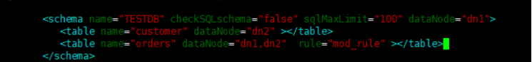

#### 修改配置文件 rule.xml 

```
#在 rule 配置文件里新增分片规则 mod_rule，并指定规则适用字段为 customer_id，
#还有选择分片算法 mod-long（对字段求模运算） ， customer_id 对两个节点求模，根据结果分片
#配置算法 mod-long 参数 count 为 2，两个节点
<tableRule name="mod_rule">
    <rule>
          <columns>customer_id</columns>
          <algorithm>mod-long</algorithm>
    </rule>
</tableRule>
…
<function name="mod-long" class="io.mycat.route.function.PartitionByMod">
      <!-- how many data nodes -->
      <property name="count">2</property>
</function>
```

**如图：**

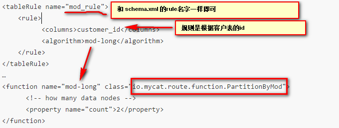

由于之前主机二（192.168.2.3）没有order表，所以需要先手动创建表该表。

然后启动Mycat使其生效。

#### 测试效果

```
INSERT INTO orders(id,order_type,customer_id,amount) VALUES (1,101,100,100100);
INSERT INTO orders(id,order_type,customer_id,amount) VALUES(2,101,100,100300);
INSERT INTO orders(id,order_type,customer_id,amount) VALUES(3,101,101,120000);
INSERT INTO orders(id,order_type,customer_id,amount) VALUES(4,101,101,103000);
INSERT INTO orders(id,order_type,customer_id,amount) VALUES(5,102,101,100400);
INSERT INTO orders(id,order_type,customer_id,amount) VALUES(6,102,100,100020);
```

<u>注意：customer_id字段**不能省略**。因为分表的规则是作用在该字段上面。没有该字段，规则不会生效。</u>

若出现结果为两个主机的orders表中数据分散，各有数据，即是成功。


#### 分表引出问题：

##### 问题一：数据分表存储，那么查询整体数据时，是如何？

结果图：

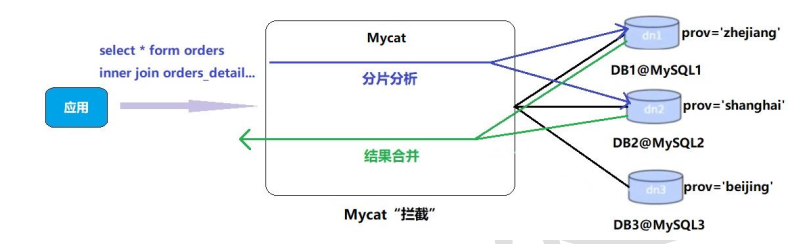

数据查询结果：

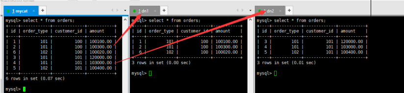

分析：如上面所看到，主机一存储为1，2，3，主机二存储为3，4，5，查询出为整体为1，2，6，3，4，5、即是查询的结果为Mycat合并后的结果。


##### 问题二：分表后，若实现和某些紧密的表的join操作，效率和性能问题如何解决？

Mycat 借鉴了 NewSQL 领域的新秀 Foundation DB 的设计思路， Foundation DB 创新性的提
出了 Table Group 的概念，其将<u>**子表的存储位置依赖于主表**</u>，***<u>并且物理上紧邻存放</u>***，因此彻底解决了
JION 的效率和性能问 题，根据这一思路，提出了基于 E-R 关系的数据分片策略，子表的记录与所
关联的父表记录存放在同一个数据分片上。 


*修改 schema.xml 配置文件* 

```
<table name="orders" dataNode="dn1,dn2" rule="mod_rule" >
      <childTable name="orders_detail" primaryKey="id" joinKey="order_id" parentKey="id" />
</table>
```

```
#在dn2 创建 orders_detail 表
#重启 Mycat
#访问 Mycat 向 orders_detail 表插入数据
INSERT INTO orders_detail(id,detail,order_id) values(1,'detail1',1);
INSERT INTO orders_detail(id,detail,order_id) VALUES(2,'detail1',2);
INSERT INTO orders_detail(id,detail,order_id) VALUES(3,'detail1',3);
INSERT INTO orders_detail(id,detail,order_id) VALUES(4,'detail1',4);
INSERT INTO orders_detail(id,detail,order_id) VALUES(5,'detail1',5);
INSERT INTO orders_detail(id,detail,order_id) VALUES(6,'detail1',6);
#在mycat、 dn1、 dn2中运行两个表join语句
Select o.*,od.detail from orders o inner join orders_detail od on o.id=od.order_id;
```


##### 问题三：对于该表数据变动不大，但是大部分表有依赖此表，对于这种表，如何解决这个问题？

字典表具有以下几个特性：
​	① 变动不频繁
​	② 数据量总体变化不大
​	③ 数据规模不大，很少有超过数十万条记录 

全局表具有以下特性：
​	① 全局表的插入、更新操作会实时在所有节点上执行，保持各个分片的数据一致性
​	② 全局表的查询操作，只从一个节点获取
​	③ 全局表可以跟任何一个表进行 JOIN 操作 


**使用Mycat的全局表。即是每一个主机都有一份该表，那么每一个主机都能够使用一模一样的表。**

配置：

修改 schema.xml 配置文件 

```shell
…
<table name="orders" dataNode="dn1,dn2" rule="mod_rule" >
	<childTable name="orders_detail" primaryKey="id" joinKey="order_id" parentKey="id" />
</table>
<table name="dict_order_type" dataNode="dn1,dn2" type="global" ></table>
…
```

该表的type属性设置为global即可。

由于主机二之前没有dict_order_type ，所以需要手动创建

**测试：**

1. 重启 Mycat
2. 访问 Mycat 向 dict_order_type 表插入数据
3. INSERT INTO dict_order_type(id,order_type) VALUES(101,'type1');
   INSERT INTO dict_order_type(id,order_type) VALUES(102,'type2'); 

**预期结果：**

在Mycat、 dn1、 dn2中查询表数据 一模一样即可。


### 常用分片规则 

1、 取模 

2、 分片枚举 

3、 范围约定 

4、 按日期（天）分片 

#### 取模：

此规则为对分片字段求摸运算。 也是水平分表最常用规则。 orders 表采用了此规则。 

#### 分片枚举

通过在配置文件中配置可能的**枚举 id**，<u>自己配置分片</u>，本规则适用于特定的场景，比如有些业务
需要按照省份或区县来做保存，而全国省份区县固定的，这类业务使用本条规则 

**配置：**

<u>前言：由于配置和之前的orders配置流程一样，古下面的配置都以简单的配置，具体参照orders订单表的配置工厂。</u>


1. 修改schema.xml配置文件 。

```
<table name="orders_ware_info" dataNode="dn1,dn2" rule="sharding_by_intfile" ></table>
```


2. 修改rule.xml配置文件 。

```shell
<tableRule name="sharding_by_intfile">
      <rule>
            <columns>areacode</columns>
            <algorithm>hash-int</algorithm>
      </rule>
</tableRule>
…
<function name="hash-int"  class="io.mycat.route.function.PartitionByFileMap">   #这个才是重点
      <property name="mapFile">partition-hash-int.txt</property>
      <property name="type">1</property>
      <property name="defaultNode">0</property>
</function>
```

解析：

columns：分片字段， algorithm：分片函数
mapFile： 标识配置文件名称， type： 0为int型、 非0为String，
defaultNode： 默认节点:小于 0 表示不设置默认节点，大于等于 0 表示设置默认节点，
设置默认节点如果碰到不识别的枚举值，就让它路由到默认节点，如不设置不识别就报错

3. 修改partition-hash-int.txt配置文件

`110=0`
`120=1`

4. 重启 Mycat
5. 访问Mycat创建表

   订单归属区域信息表：

```shell
CREATE TABLE orders_ware_info
(
  `id` INT AUTO_INCREMENT comment '编号',
  `order_id` INT comment '订单编号',
  `address` VARCHAR(200) comment '地址',
  `areacode` VARCHAR(20) comment '区域编号',
  PRIMARY KEY(id)
);
```

（6） 插入数据
`INSERT INTO orders_ware_info(id, order_id,address,areacode) VALUES (1,1,'北京','110');`
`INSERT INTO orders_ware_info(id, order_id,address,areacode) VALUES (2,2,'天津','120');` 

7. 结果：

8. 预期结果：

   两个主机上的表数据分别各一个。

#### 范围约定

此分片适用于，提前规划好分片字段某个范围属于哪个分片。 

（1） 修改schema.xml配置文件

```
<table name="payment_info" dataNode="dn1,dn2" rule="auto_sharding_long" ></table>
```

（2） 修改rule.xml配置文件

```
<tableRule name="auto_sharding_long">
<rule>
<columns>order_id</columns>
<algorithm>rang-long</algorithm>
</rule>
</tableRule>
…
<function name="rang-long"
class="io.mycat.route.function.AutoPartitionByLong">
<property name="mapFile">autopartition-long.txt</property>
<property name="defaultNode">0</property>
</function> 
```

columns：分片字段， algorithm：分片函数

mapFile： 标识配置文件名称， type： 0为int型、 非0为String，

defaultNode： 默认节点:小于 0 表示不设置默认节点，大于等于 0 表示设置默认节点，

设置默认节点如果碰到不识别的枚举值，就让它路由到默认节点，如不设置不识别就报错


（3） 修改autopartition-long.txt配置文件

```
0-102=0
103-200=1
```


（4） 重启 Mycat

（5） 访问Mycat创建表

支付信息表

```
CREATE TABLE payment_info
(
`id` INT AUTO_INCREMENT comment '编号',
`order_id` INT comment '订单编号',
`payment_status` INT comment '支付状态',
PRIMARY KEY(id)
);
```


（6） 插入数据

```
INSERT INTO payment_info (id,order_id,payment_status) VALUES (1,101,0);
INSERT INTO payment_info (id,order_id,payment_status) VALUES (2,102,1);
INSERT INTO payment_info (id,order_id ,payment_status) VALUES (3,103,0);
INSERT INTO payment_info (id,order_id,payment_status) VALUES (4,104,1);
```


（7） 预期结果：

主机一和主机二的表上各有一个数据。


#### 按日期（天）分片 

此规则为按天分片。 设定时间格式、范围 

（1） 修改schema.xml配置文件

```
<table name="login_info" dataNode="dn1,dn2" rule="sharding_by_date" ></table>
```


（2） 修改rule.xml配置文件

```
<tableRule name="sharding_by_date">
    <rule>
        <columns>login_date</columns>
        <algorithm>shardingByDate</algorithm>
    </rule>
</tableRule>
…
<function name="shardingByDate" class="io.mycat.route.function.PartitionByDate">
      <property name="dateFormat">yyyy-MM-dd</property>
      <property name="sBeginDate">2019-01-01</property>
      <property name="sEndDate">2019-01-04</property> 
      <property name="sPartionDay">2</property>
</function>
```

columns：分片字段， algorithm：分片函数

dateFormat ：日期格式

sBeginDate ：开始日期

sEndDate：结束日期,则代表数据达到了这个日期的分片后循环从开始分片插入

sPartionDay ：分区天数，即默认从开始日期算起，分隔 2 天一个分区

（3） 重启 Mycat

（4） 访问Mycat创建表

用户信息表

```
CREATE TABLE login_info
(
    `id` INT AUTO_INCREMENT comment '编号',
    `user_id` INT comment '用户编号',
    `login_date` date comment '登录日期',
    PRIMARY KEY(id)
);
```

（6） 插入数据

```
INSERT INTO login_info(id,user_id,login_date) VALUES (1,101,'2019-01-01');
INSERT INTO login_info(id,user_id,login_date) VALUES (2,102,'2019-01-02');
INSERT INTO login_info(id,user_id,login_date) VALUES (3,103,'2019-01-03');
INSERT INTO login_info(id,user_id,login_date) VALUES (4,104,'2019-01-04');
INSERT INTO login_info(id,user_id,login_date) VALUES (5,103,'2019-01-05');
INSERT INTO login_info(id,user_id,login_date) VALUES (6,104,'2019-01-06'); 
```

结果：两个数据库中表各有数据。


### 全局序列 

在实现分库分表的情况下，数据库自增主键已无法保证自增主键的全局唯一。为此， Mycat 提供
了全局 sequence，并且提供了包含本地配置和数据库配置等多种实现方式 

1、 本地文件 ：

2、 数据库方式 

3、 时间戳方式 

4、 自主生成全局序列 


##### 本地文件方式

参考官方文档：P106页

**原理**： 此方式 MyCAT 将 sequence 配置到文件中，当使用到 sequence 中的配置后， MyCAT 会更下
classpath 中的 sequence_conf.properties 文件中 sequence 当前的值。
配置方式：
在 sequence_conf.properties 文件中做如下配置：

```
GLOBAL_SEQ.HISIDS=
GLOBAL_SEQ.MINID=1001
GLOBAL_SEQ.MAXID=1000000000
GLOBAL_SEQ.CURID=1000
```

其中 HISIDS 表示使用过的历史分段(一般无特殊需要可不配置)， MINID 表示最小 ID 值， MAXID 表示最大
ID 值， CURID 表示当前 ID 值。
server.xml 中配置：

```
<system><property name="sequnceHandlerType">0</property></system>
```


注： sequnceHandlerType 需要配置为 0，表示使用本地文件方式。

使用示例：

```
insert into table1(id,name) values(next value for MYCATSEQ_GLOBAL,‘test’);
```


缺点：当 MyCAT 重新发布后，配置文件中的 sequence 会恢复到初始值。
优点：本地加载，读取速度较快 


##### 数据库方式 

**原理** :

在数据库中建立一张表，存放 sequence 名称(name)， sequence 当前值(current_value)，步长(increment
int 类型每次读取多少个 sequence，假设为 K)等信息； 

**Sequence 获取步骤：**
1).	当初次使用该 sequence 时，根据传入的 sequence 名称，从数据库这张表中读取 current_value，和
increment 到 MyCat 中，并将数据库中的 current_value 设置为原 current_value 值+increment 值。
​	MyCat 将读取到 current_value+increment 作为本次要使用的 sequence 值，下次使用时，自动加 1，当
使用 increment 次后，执行步骤 1)相同的操作。
​	MyCat 负责维护这张表，用到哪些 sequence，只需要在这张表中插入一条记录即可。 若某次读取的
sequence 没有用完，系统就停掉了，则这次读取的 sequence 剩余值不会再使用。 


**配置**

配置方式： 

server.xml 配置：

```
<system><property name="sequnceHandlerType">1</property></system>
```


注： sequnceHandlerType 需要配置为 1，表示使用数据库方式生成 sequence。

补充： 全局序列类型： 0-本地文件， 1-数据库方式， 2-时间戳方式。 

数据库配置： 

1) 创建 MYCAT_SEQUENCE 表 

```shell
DROP TABLE IF EXISTS MYCAT_SEQUENCE;    #创建存放 sequence 的表
# name sequence 名称
# current_value 当前 value
# increment 增长步长! 可理解为 mycat 在数据库中一次读取多少个 sequence. 当这些用完后, 下次再从数
#据库中读取。
CREATE TABLE MYCAT_SEQUENCE (
    name VARCHAR(50) NOT NULL,
    current_value INT NOT NULL,
    increment INT NOT NULL DEFAULT 100,
    PRIMARY KEY(name)
) ENGINE=InnoDB;
# 插入一条 sequence
INSERT INTO MYCAT_SEQUENCE(name,current_value,increment)
VALUES (‘GLOBAL’, 100000,100);
```

2) 创建相关 function 

```mysql
# 获取当前 sequence 的值 (返回当前值,增量)
DROP FUNCTION IF EXISTS mycat_seq_currval;
DELIMITER
CREATE FUNCTION mycat_seq_currval(seq_name VARCHAR(50)) RETURNS varchar(64) CHARSET utf-8
DETERMINISTIC
BEGIN
    DECLARE retval VARCHAR(64);
    SET retval=“-999999999,null”;
    SELECT concat(CAST(current_value AS CHAR),“,”,CAST(increment AS CHAR)) INTO retval FROM
    MYCAT_SEQUENCE WHERE name = seq_name;
    RETURN retval;
END
DELIMITER;
# 设置 sequence 值
DROP FUNCTION IF EXISTS mycat_seq_setval;
DELIMITER
  CREATE FUNCTION mycat_seq_setval(seq_name VARCHAR(50),value INTEGER) RETURNS varchar(64)
  CHARSET utf-8
DETERMINISTIC
BEGIN
    UPDATE MYCAT_SEQUENCE
    SET current_value = value
    WHERE name = seq_name;
    RETURN mycat_seq_currval(seq_name);
END
DELIMITER;
# 获取下一个 sequence 值
DROP FUNCTION IF EXISTS mycat_seq_nextval;
DELIMITER
CREATE FUNCTION mycat_seq_nextval(seq_name VARCHAR(50)) RETURNS varchar(64) CHARSET
utf-8
DETERMINISTIC
BEGIN
    UPDATE MYCAT_SEQUENCE
    SET current_value = current_value + increment WHERE name = seq_name;
    RETURN mycat_seq_currval(seq_name);
END
DELIMITER;
```

4) sequence_db_conf.properties 相关配置,指定 sequence 相关配置在哪个节点上：
例如：

```
USER_SEQ=test_dn1
```


注意： MYCAT_SEQUENCE 表和以上的 3 个 function， 需要放在**同一个节点**上。 function 请直接在具体节
点的数据库上执行，如果执行的时候报：you might want to use the less safe log_bin_trust_function_creators variable需要对数据库做如下设置：
windows 下 my.ini[mysqld]加上 log_bin_trust_function_creators=1
linux 下/etc/my.cnf 下 my.ini[mysqld]加上 log_bin_trust_function_creators=1
修改完后，即可在 mysql 数据库中执行上面的函数。
使用示例：

```
insert into table1(id,name) values(next value for MYCATSEQ_GLOBAL,‘test’)； 
```


##### 本地时间戳方式 

ID= 64 位二进制 (42(毫秒)+5(机器 ID)+5(业务编码)+12(重复累加)
换算成十进制为 18 位数的 long 类型，每毫秒可以并发 12 位二进制的累加。 

**使用方式**：
a. 配 置 server.xml

```
<property name="sequnceHandlerType">2</property>
```


b. 在 mycat 下配置： sequence_time_conf.properties

```
WORKID=0-31 #任意整数
DATAACENTERID=0-31 #任意整数
```


多个个 mycat 节点下每个 mycat 配置的 WORKID， DATAACENTERID 不同，组成唯一标识，总共支持
32*32=1024 种组合。
ID 示例： 56763083475511 


① 优点： 配置简单
② 缺点： 18 位 ID 过长 

##### 其他方式

- Zk 递增方式
- 使用 catelet 注解方式 
- 利用 zookeeper 方式实现  


### 基于 HA 机制的 Mycat 高可用 

在实际项目中， Mycat 服务也需要考虑高可用性，如果 Mycat 所在服务器出现宕机，或 Mycat 服
务故障，需要有备机提供服务，需要考虑 Mycat 集群。 

我们可以使用 HAProxy + Keepalived 配合两台 Mycat 搭起 Mycat 集群，实现高可用性。 HAProxy
实现了 MyCat 多节点的集群高可用和负载均衡， 而 HAProxy 自身的高可用则可以通过 Keepalived 来
实现。 

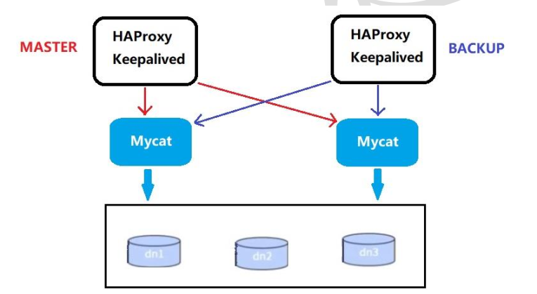

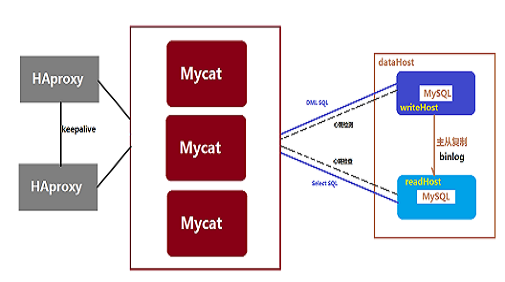

####安装配置 HAProxy 

```shell
#1准备好HAProxy安装包，传到/opt目录下

#2解压到/usr/local/src
  tar -zxvf haproxy-1.5.18.tar.gz -C /usr/local/src
  
#3进入解压后的目录，查看内核版本， 进行编译
  cd /usr/local/src/haproxy-1.5.18
  uname -r
  make TARGET=linux310 PREFIX=/usr/local/haproxy  ARCH=x86_64
# ARGET=linux310，内核版本，使用uname -r查看内核，如： 3.10.0-514.el7，此时该参数就为linux310；
# ARCH=x86_64，系统位数；
# PREFIX=/usr/local/haprpxy #/usr/local/haprpxy，为haprpxy安装路径。

#4编译完成后，进行安装
  make install PREFIX=/usr/local/haproxy
#5安装完成后， 创建目录、 创建HAProxy配置文件
  mkdir -p /usr/data/haproxy/
  vim /usr/local/haproxy/haproxy.conf
#6向配置文件中插入以下配置信息,并保存
global
    log 127.0.0.1 local0
    #log 127.0.0.1 local1 notice
    #log loghost local0 info
    maxconn 4096
    chroot /usr/local/haproxy     #
    pidfile /usr/data/haproxy/haproxy.pid   #
    uid 99
    gid 99
    daemon
    #debug
    #quiet
defaults
     log   global
     mode tcp
     option  abortonclose
     option  redispatch
     retries  3
     maxconn  2000
     timeout  connect 5000
     timeout  client 50000
     timeout  server 50000
listen proxy_status
	bind :48066
        mode tcp
        balance roundrobin
        server mycat_1 192.168.2.2:8066 check inter 10s    #mycat所在的ip
        server mycat_2 192.168.2.3:8066 check inter 10s    #mycat所在的ip
frontend admin_stats
	bind :7777
        mode http
        stats enable
        option httplog
        maxconn 10
        stats refresh 30s
        stats uri /admin    #浏览访问时要加的后缀
        stats auth admin:123123   #账号  密码
        stats hide-version
        stats admin if TRUE
```

1. **启动HAProxy**

```
/usr/local/haproxy/sbin/haproxy -f /usr/local/haproxy/haproxy.conf 
```

2. **查看HAProxy进程**

```
ps -ef|grep haproxy 
```

3. 打开浏览器访问

`http://192.168.140.125:7777/admin` 

在弹出框输入用户名： admin密码： 123123 

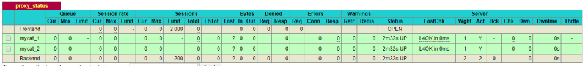

4. 验证负载均衡，通过HAProxy访问Mycat

```
mysql -umycat -p123456 -h 192.168.140.126 -P 48066 
```


####配置 Keepalived 


```shell
#1准备好Keepalived安装包，传到/opt目录下
#2解压到/usr/local/src
tar -zxvf keepalived-1.4.2.tar.gz -C /usr/local/src
#3安装依赖插件
yum install -y gcc openssl-devel popt-devel
#3进入解压后的目录， 进行配置， 进行编译
cd /usr/local/src/keepalived-1.4.2
./configure --prefix=/usr/local/keepalived
#4进行编译， 完成后进行安装
make && make install
#5运行前配置
cp /usr/local/src/keepalived-1.4.2/keepalived/etc/init.d/keepalived /etc/init.d/
mkdir /etc/keepalived
cp /usr/local/keepalived/etc/keepalived/keepalived.conf /etc/keepalived/
cp /usr/local/src/keepalived-1.4.2/keepalived/etc/sysconfig/keepalived /etc/sysconfig/
cp /usr/local/keepalived/sbin/keepalived /usr/sbin/
#6修改配置文件
vim /etc/keepalived/keepalived.conf
```

```shell
#修改内容如下
!Configuration File for keepalived
global_defs {
    notification_email {
        xlcocoon@foxmail.com
    }
    notification_email_from keepalived@showjoy.com
    smtp_server 127.0.0.1
    smtp_connect_timeout 30
    router_id LVS_DEVEL
    vrrp_skip_check_adv_addr
    vrrp_garp_interval 0
    vrrp_gna_interval 0
}
vrrp_instance VI_1 {
    #主机配MASTER，备机配BACKUP,这个是主机，所以是master
    state MASTER
    #所在机器网卡
    interface ens33
    virtual_router_id 51
    #数值越大优先级越高
    priority 100
    advert_int 1
    authentication {
        auth_type PASS
        auth_pass 1111
    }
    virtual_ipaddress {
        #虚拟IP
        192.168.140.200
    }
}
virtual_server 192.168.140.200 48066 {
    delay_loop 6
    lb_algo rr
    lb_kind NAT
    persistence_timeout 50
    protocol TCP
    real_server 192.168.2.2 48066 {
        weight 1
        TCP_CHECK {
            connect_timeout 3
            retry 3
            delay_before_retry 3
         }
    }
real_server 192.168.2.3 48600 {
    weight 1
    TCP_CHECK {
        connect_timeout 3
        nb_get_retry 3
        delay_before_retry 3
    }  
  }
}
```


启动：

```
#1启动Keepalived
service keepalived start
#2登录验证
mysql -umycat -p123456 -h 192.168.140.200 -P 48066
```

测试：

```
#1关闭mycat
#2通过虚拟ip查询数据
mysql -umycat -p123456 -h 192.168.140.200 -P 48066
```


### 权限控制

1、 user 标签权限控制 

目前 Mycat 对于中间件的连接控制并没有做太复杂的控制，目前只做了中间件逻辑库级别的读
写权限控制。是通过 server.xml 的 user 标签进行配置。 

如下：

```
<user name="mycat">
    <property name="password">123456</property>
    <property name="schemas">TESTDB</property>
</user>
<user name="user">
    <property name="password">user</property>
    <property name="schemas">TESTDB</property>
    <property name="readOnly">true</property>
</user>
```

配置说明

| 标签属性     | 说明                                       |
| -------- | ---------------------------------------- |
| name     | 应用连接中间件逻辑库的用户名                           |
| password | 该用户对应的密码                                 |
| TESTDB   | 应用当前连接的逻辑库中所对应的逻辑表。 schemas 中可以配置一个或多个   |
| readOnly | 应用连接中间件逻辑库所具有的权限。 true 为只读， false 为读写都有，默认为 false |

2、 privileges 标签权限控制 

在 user 标签下的 **privileges** 标签可以对逻辑库（schema）、表（table）进行精细化的 DML 权限控
制。privileges 标签下的 **check** 属性，<u>如为 *true 开启权限检查，为 false 不开启*</u>，默认为 false。
由于 Mycat 一个用户的 schemas 属性可配置多个逻辑库（schema） ，所以 privileges 的下级
节点 schema 节点同样可配置多个，对多库多表进行细粒度的 DML 权限控制。 

例如：

```shell
<user name="mycat">
    <property name="password">123456</property>
    <property name="schemas">TESTDB</property>
    <!-- 表级 DML 权限设置 -->
    <privileges check="true">
        <schema name="TESTDB" dml="1111" >
              <table name="orders" dml="0000"></table>
              <!--<table name="tb02" dml="1111"></table>-->
        </schema>
    </privileges>
</user>
```

配置说明

| DML 权限 | 增加（insert） | 更新（update） | 查询（select） | 删除（select） |
| ------ | ---------- | ---------- | ---------- | ---------- |
| 0000   | 禁止         | 禁止         | 禁止         | 禁止         |
| 0010   | 禁止         | 禁止         | 可以         | 禁止         |
| 1110   | 可以         | 禁止         | 禁止         | 禁止         |
| 1111   | 可以         | 可以         | 可以         | 可以         |

### SQL 拦截 

firewall 标签用来定义防火墙； firewall 下 whitehost 标签用来定义 IP 白名单 ， blacklist 用来定义
SQL 黑名单。 

1.  白名单:可以通过设置白名单， 实现某主机某用户可以访问 ,Mycat而其他主机用户禁止访问。
2.  黑名单:可以通过设置黑名单， 实现 Mycat 对具体 SQL 操作的拦截， 如增删改查等操作的拦截 

```shell
#设置白名单
#server.xml配置文件firewall标签
#配置只有192.168.140.128主机可以通过mycat用户访问
<firewall>
    <whitehost>
   		 <host host="192.168.140.128" user="mycat"/>
    </whitehost>
</firewall>
```

**结果：**

使用mycat用户访问可以正常访问，主机换user用户访问，禁止访问 


```
#设置黑名单
#server.xml配置文件firewall标签
#配置禁止mycat用户进行删除操作
<firewall>
  <whitehost>
 		 <host host="192.168.2.2" user="mycat"/>
  </whitehost>
  <blacklist check="true">
 		 <property name="deleteAllow">false</property>
  </blacklist>
</firewall>
```


拦截功能列表

| 配置项              | 缺省值  | 描述                    |
| ---------------- | ---- | --------------------- |
| selelctAllow     | true | 是否允许执行 SELECT 语句      |
| deleteAllow      | true | 是否允许执行 DELETE 语句      |
| updateAllow      | true | 是否允许执行 UPDATE 语句      |
| insertAllow      | true | 是否允许执行 INSERT 语句      |
| createTableAllow | true | 是否允许创建表               |
| setAllow         | true | 是否允许使用 SET 语法         |
| alterTableAllow  | true | 是否允许执行 Alter Table 语句 |
| dropTableAllow   | true | 是否允许修改表               |
| commitAllow      | true | 是否允许执行 commit 操作      |
| rollbackAllow    | true | 是否允许执行 roll back 操作   |

### Mycat 监控工具 

Mycat-web 是 Mycat 可视化运维的管理和监控平台，弥补了 Mycat 在监控上的空白。帮 Mycat 分
担统计任务和配置管理任务。 Mycat-web 引入了 ZooKeeper 作为配置中心，可以管理多个节点。
Mycat-web 主要管理和监控 Mycat 的流量、连接、活动线程和内存等，具备 IP 白名单、邮件告警等模
块，还可以统计 SQL 并分析慢 SQL 和高频 SQL 等。为优化 SQL 提供依据 。

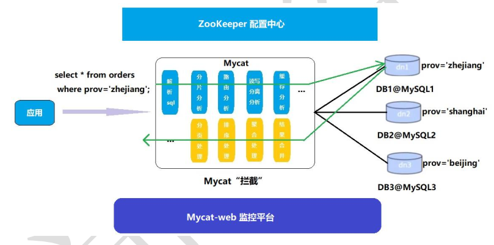

安装配置：

1、 ZooKeeper 安装 

```
#1下载安装包http://zookeeper.apache.org/

#2 安装包拷贝到Linux系统/opt目录下，并解压
tar -zxvf zookeeper-3.4.11.tar.gz

#3 进入ZooKeeper解压后的配置目录（conf） ，复制配置文件并改名
cp zoo_sample.cfg zoo.cfg

#4 进入ZooKeeper的命令目录（bin） ，运行启动命令
./zkServer.sh start

#5 ZooKeeper服务端口为2181，查看服务已经启动
netstat -ant | grep 2181
```

2、 Mycat-web 安装 

```
#1下载安装包http://www.mycat.io/

#2 安装包拷贝到Linux系统/opt目录下，并解压
tar -zxvf Mycat-web-1.0-SNAPSHOT-20170102153329-linux.tar.gz

#3 拷贝mycat-web文件夹到/usr/local目录下
cp -r mycat-web /usr/local

#4 进入mycat-web的目录下运行启动命令
cd /usr/local/mycat-web/
./start.sh &

#5 Mycat-web服务端口为8082，查看服务已经启动
netstat -ant | grep 8082

#6 通过地址访问服务
http://192.168.140.127:8082/mycat/
```

3、 Mycat-web 配置 

1 先在注册中心配置ZooKeeper地址，配置后刷新页面

2 新增Mycat监控实例 


4.其他功能执行摸索